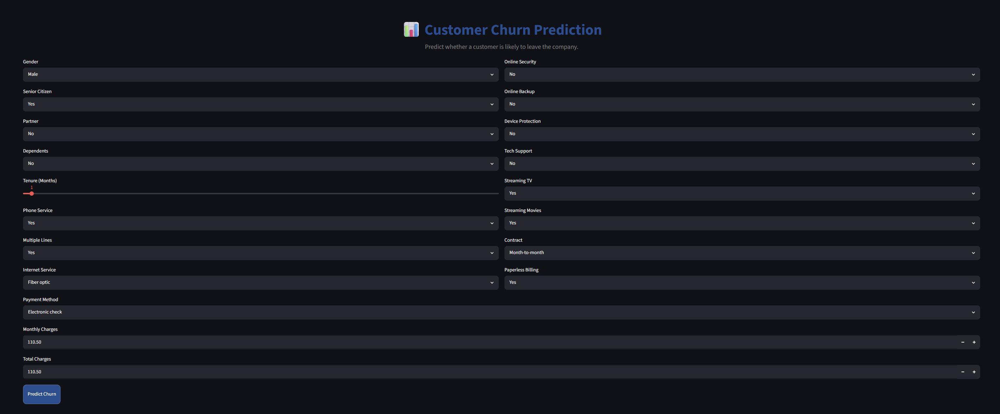
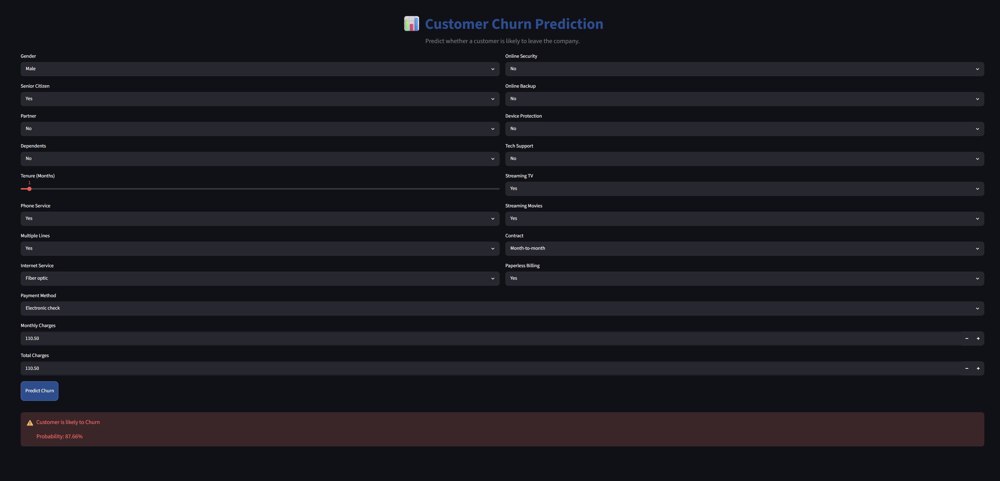
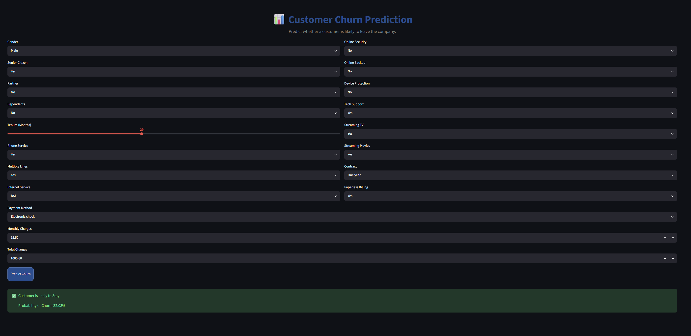

# Customer Churn Prediction using Machine Learning

## Live Demo
**Streamlit App:** https://customer-churn-prediction-rishi.streamlit.app

A Machine Learning web application built with **Python**, **Scikit-learn**, and **Streamlit** to predict whether a telecom customer is likely to churn based on customer information. The application provides real-time predictions through an interactive and user-friendly web interface.

---

## Project Overview

Customer churn prediction helps companies identify customers who are likely to discontinue their services. By predicting churn in advance, businesses can take preventive actions to improve customer retention.

This project follows a complete machine learning workflow, including data preprocessing, exploratory data analysis (EDA), feature engineering, model training, evaluation, and deployment.

---

## Features

- Predict customer churn in real time
- Clean and interactive Streamlit interface
- Data preprocessing and categorical feature encoding
- Comparison of multiple machine learning models
- Fast and accurate predictions
- Easy deployment using Streamlit Community Cloud

---

## Technologies Used

- Python
- Streamlit
- Pandas
- NumPy
- Scikit-learn
- Joblib

---

## Machine Learning Workflow

- Data Cleaning
- Exploratory Data Analysis (EDA)
- Handling Missing Values
- Feature Encoding
- Feature Selection
- Model Training
- Model Evaluation
- Model Comparison
- Model Deployment

---

## Model Comparison

| Model | Test Accuracy |
|--------|--------------:|
| Decision Tree | 68.12% |
| Random Forest | 77.71% |
| Final Deployed Model | **80.77%** |

### Cross Validation Accuracy

| Model | Average Accuracy |
|--------|-----------------:|
| Decision Tree | 78.10% |
| Random Forest | **83.78%** |
| XGBoost | 83.12% |

Several machine learning models were trained and evaluated. The model with the best overall performance on the test dataset was selected for deployment.

---

## Final Model Performance

### Accuracy

**80.77%**

### Confusion Matrix

```
                Predicted
              No      Yes

Actual No     950      86
Actual Yes    185     188
```

### Classification Report

| Metric | No Churn | Churn |
|---------|---------:|------:|
| Precision | 0.84 | 0.69 |
| Recall | 0.92 | 0.50 |
| F1-Score | 0.88 | 0.58 |

**Overall Accuracy:** 80.77%

---

## Application Screenshots

### Home Page



### Prediction Example - Customer Will Leave



### Prediction Example - Customer Will Stay



---

## Project Structure

```
Customer-Churn-Prediction/
│
├── app.py
├── customer_churn_model.pkl
├── encoders.pkl
├── Customer_Churn_Prediction.ipynb
├── requirements.txt
├── README.md
└── screenshots/
    ├── home_page.png
    ├── customer_will_leave.png
    └── customer_will_stay.png
```

---

## Installation

Clone the repository

```bash
git clone https://github.com/rishineymar0014/customer-churn-prediction.git
```

Go to the project folder

```bash
cd customer-churn-prediction
```

Install the required libraries

```bash
pip install -r requirements.txt
```

Run the application

```bash
streamlit run app.py
```

---

## Future Improvements

- Improve model recall for churn prediction
- Hyperparameter tuning
- Add interactive data visualization dashboards
- Support CSV file upload for batch predictions
- Deploy using Docker and cloud platforms

---

## Author

**Rishi Kumar**

GitHub: https://github.com/rishineymar0014

---

## License

This project is available for educational and portfolio purposes.